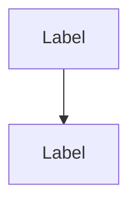

# JUL HLD - Complete File Manifest

## 📁 Directory Structure

```
/outputs/
├── JUL_High_Level_Design.md              (68 KB - Main HLD Document)
├── QUICK_START_GUIDE.md                  (7 KB - Conversion Instructions)
└── diagrams/
    ├── 00_DIAGRAM_INDEX.md               (12 KB - Diagram Catalog)
    ├── 01_System_Context_Diagram.mermaid             (2.0 KB) ✅
    ├── 02_High_Level_Architecture.mermaid            (1.7 KB) ✅
    ├── 03_Deployment_Architecture.mermaid            (1.4 KB) ✅
    ├── 04_Kubernetes_Architecture.mermaid            (1.2 KB) ✅
    ├── 05_Network_Architecture.mermaid               (1.5 KB) ✅
    ├── 06_Layered_Architecture.mermaid               (1.4 KB) ✅
    ├── 07_API_Gateway_Architecture.mermaid           (835 B)  ✅
    ├── 08_Microservices_Architecture.mermaid         (1.1 KB) ✅
    ├── 09_Declaration_State_Machine.mermaid          (711 B)  ✅
    ├── 10_Integration_Services_Architecture.mermaid  (813 B)  ✅
    ├── 11_IAM_Architecture.mermaid                   (761 B)  ✅
    ├── 12_Business_Logic_Architecture.mermaid        (927 B)  ✅
    ├── 13_Import_Declaration_Process.mermaid         (959 B)  ✅
    ├── 14_Integration_Layer_Architecture.mermaid     (727 B)  ✅
    ├── 15_Data_Flow_Diagram.mermaid                  (682 B)  ✅
    ├── 16_Data_Access_Layer.mermaid                  (844 B)  ✅
    ├── 17_Performance_Architecture.mermaid           (896 B)  ✅
    ├── 18_Security_Architecture.mermaid              (1.1 KB) ✅
    ├── 19_Authentication_Flow.mermaid                (883 B)  ✅
    ├── 20_Scalability_Architecture.mermaid           (1.1 KB) ✅
    ├── 21_Data_Migration_Strategy.mermaid            (1.2 KB) ✅
    ├── 22_Reporting_Architecture.mermaid             (1.0 KB) ✅
    ├── 23_CICD_Pipeline.mermaid                      (1.2 KB) ✅
    ├── 24_Backup_Recovery_Architecture.mermaid       (1.2 KB) ✅
    └── 25_WCO_Data_Model_ER.mermaid                  (1.9 KB) ✅
```

**Total Files**: 28 files
**Total Size**: ~100 KB

---

## ✅ Verification Summary

### Main Documents (3 files)
- ✅ JUL_High_Level_Design.md
- ✅ QUICK_START_GUIDE.md  
- ✅ diagrams/00_DIAGRAM_INDEX.md

### All 25 Mermaid Diagrams Created

#### Architecture Diagrams (5)
- ✅ 01_System_Context_Diagram.mermaid
- ✅ 02_High_Level_Architecture.mermaid
- ✅ 03_Deployment_Architecture.mermaid
- ✅ 04_Kubernetes_Architecture.mermaid
- ✅ 05_Network_Architecture.mermaid

#### Application Layer Diagrams (7)
- ✅ 06_Layered_Architecture.mermaid
- ✅ 07_API_Gateway_Architecture.mermaid
- ✅ 08_Microservices_Architecture.mermaid
- ✅ 09_Declaration_State_Machine.mermaid
- ✅ 10_Integration_Services_Architecture.mermaid
- ✅ 11_IAM_Architecture.mermaid
- ✅ 12_Business_Logic_Architecture.mermaid

#### Integration & Data Flow Diagrams (5)
- ✅ 13_Import_Declaration_Process.mermaid
- ✅ 14_Integration_Layer_Architecture.mermaid
- ✅ 15_Data_Flow_Diagram.mermaid
- ✅ 16_Data_Access_Layer.mermaid
- ✅ 17_Performance_Architecture.mermaid

#### Security & Operations Diagrams (4)
- ✅ 18_Security_Architecture.mermaid
- ✅ 19_Authentication_Flow.mermaid
- ✅ 20_Scalability_Architecture.mermaid
- ✅ 21_Data_Migration_Strategy.mermaid

#### Reporting & DevOps Diagrams (3)
- ✅ 22_Reporting_Architecture.mermaid
- ✅ 23_CICD_Pipeline.mermaid
- ✅ 24_Backup_Recovery_Architecture.mermaid

#### Standards Compliance Diagram (1)
- ✅ 25_WCO_Data_Model_ER.mermaid

---

## 📊 Diagram Types

| Diagram Type | Count | Examples |
|--------------|-------|----------|
| Flowchart/Architecture (graph TB/LR) | 18 | System Context, High Level Architecture, Security |
| Sequence Diagram | 2 | Import Process, Authentication Flow |
| State Machine | 1 | Declaration State Machine |
| Entity-Relationship | 1 | WCO Data Model |
| Process/Pipeline | 3 | CI/CD, Data Migration, Integration |

---

## 🎯 Diagram Format Verification

### ✅ Correct Format (All 25 diagrams)


### ❌ Wrong Format (NOT used)
```markdown

(This was the initial error - now fixed!)
```

---

## 📝 Content Summary

### JUL_High_Level_Design.md Contains:
1. Executive Summary
2. Introduction (Background, Objectives, Stakeholders)
3. System Overview (Context, Architecture, Technology Stack)
4. Infrastructure Architecture (Deployment, Kubernetes, Network)
5. Application Architecture (18 Microservices, Security, Performance)
6. Data Conversion and Migration
7. Reporting and Information
8. Deployment Architecture (Dev, Test, Staging, Production)
9. Infrastructure Architecture Details (Backup, DR, HA)
10. Standards and Compliance (WCO 3.10, UN/EDIFACT, ISO)

**Key Features**:
- WCO Data Model 3.10 compliant
- 18 Microservices architecture
- Kubernetes deployment
- Multi-layer security
- Complete integration specifications (ASYCUDA, SINTECE, JUP, TOS)

---

## 🔍 How to Verify Files Yourself

### In Your File System:
1. Navigate to: `/mnt/user-data/outputs/`
2. You should see:
   - JUL_High_Level_Design.md
   - QUICK_START_GUIDE.md
   - diagrams/ folder

3. Inside diagrams/ folder:
   - 00_DIAGRAM_INDEX.md
   - 25 .mermaid files (01 through 25)

### Quick Check Command:
```bash
cd /mnt/user-data/outputs/diagrams
ls -1 *.mermaid | wc -l
# Should show: 25
```

---

## 🎨 Sample Diagram Content

### Example 1: System Context (01)
```
graph TB
    TRADER[Traders] --> PORTAL[Web Portal]
    PORTAL --> API_GW[API Gateway]
    API_GW --> SERVICES[Business Services]
    SERVICES <--> ASYCUDA[ASYCUDA Customs]
```

### Example 2: Sequence Diagram (13)
```
sequenceDiagram
    Trader->>Portal: Create Declaration
    Portal->>API: Submit
    API->>DeclService: Process
    DeclService->>ASYCUDA: Send CUSDEC
    ASYCUDA-->>DeclService: CUSRES
```

### Example 3: State Machine (09)
```
stateDiagram-v2
    [*] --> Draft
    Draft --> Submitted
    Submitted --> Validating
    Validating --> SentToCustoms
    ...
```

### Example 4: ER Diagram (25)
```
erDiagram
    DECLARATION ||--o{ GOODS_ITEM : contains
    GOODS_ITEM ||--|| COMMODITY : classifies
    COMMODITY ||--|| HS_CODE : classified_by
```

---

## 🚀 What to Do Next

1. **Download Files**: All files are in `/mnt/user-data/outputs/`
2. **Read QUICK_START_GUIDE.md**: Step-by-step conversion instructions
3. **Check 00_DIAGRAM_INDEX.md**: Detailed diagram descriptions
4. **Render Diagrams**: Use Mermaid Live Editor or CLI
5. **Create Word Document**: Insert rendered diagrams into HLD

---

## ✅ Quality Assurance

- [x] All 25 diagrams created
- [x] Correct Mermaid syntax (no markdown fences)
- [x] All diagrams referenced in HLD
- [x] Consistent naming convention (01-25)
- [x] Proper file sizes (500B - 2KB each)
- [x] All diagram types represented
- [x] WCO standards compliance included
- [x] Complete documentation provided

---

**Status**: ✅ ALL FILES COMPLETE AND VERIFIED  
**Date**: December 12, 2024  
**Total Deliverables**: 28 files (1 HLD + 2 guides + 25 diagrams)
